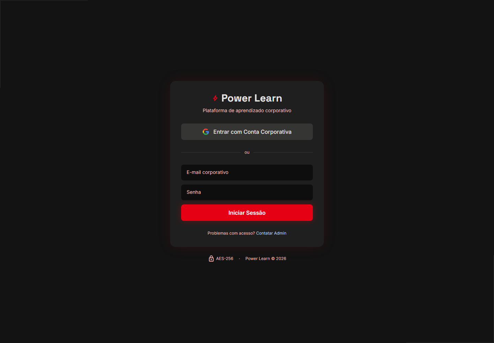
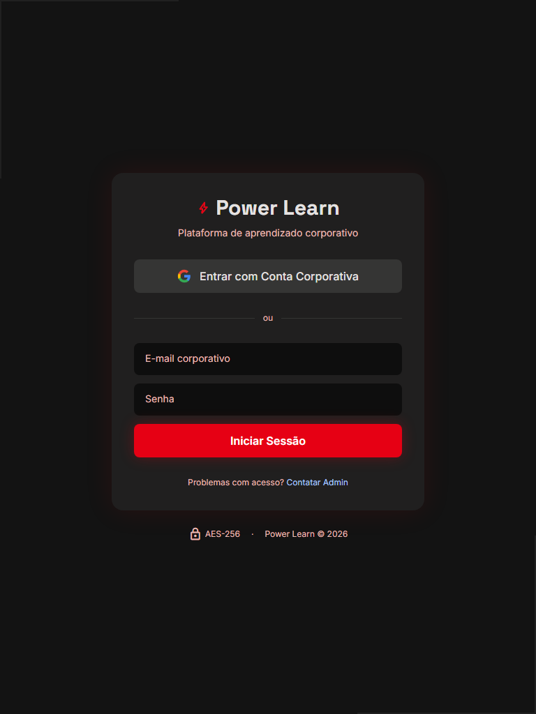

# Power Learn

> Plataforma LMS corporativa da **Sua Empresa**, com catálogo de cursos, trilhas, progresso de aprendizagem e administração de conteúdo.

## Snapshots

### Login corporativo





### Acesso protegido

As áreas de dashboard, biblioteca, leitura e administração exigem autenticação Supabase. Após o login, o usuário é direcionado conforme seu papel e departamento.

## Stack

| Camada | Tecnologia |
|---|---|
| Framework | React 19 + Vite 8 (TypeScript) |
| Estilização | Tailwind CSS v4 + `@tailwindcss/typography` |
| Roteamento | React Router v7 |
| Autenticação | Supabase Auth (Google OAuth / SSO) |
| Banco de dados | Supabase (PostgreSQL + RLS) |
| Deploy | Vercel (CI/CD automático via Git) |
| Design | Google Stitch (projeto `14804266225880767741`) |

## Páginas

| Rota | Página | Acesso |
|---|---|---|
| `/login` | Login Corporativo | Público |
| `/dashboard` | Dashboard | Autenticado |
| `/biblioteca` | Cursos e Trilhas | Autenticado |
| `/leitura/:id` | Leitura de Documentação | Autenticado |
| `/admin/usuarios` | Painel de Usuários | Admin |
| `/admin/cursos/novo` | Criar Novo Curso | Admin |
| `/admin/trilhas/nova` | Criar Nova Trilha | Admin |

## Começando

### Pré-requisitos

- Node.js 18+
- Conta no [Supabase](https://supabase.com)
- Conta no [Vercel](https://vercel.com)

### Instalação

```bash
git clone https://github.com/budswarez/Power-Learn.git
cd Power-Learn
npm install
```

### Variáveis de ambiente

Crie um arquivo `.env.local` na raiz:

```env
VITE_SUPABASE_URL=https://<project-id>.supabase.co
VITE_SUPABASE_ANON_KEY=<anon-key>
```

> Nunca publique `VITE_SUPABASE_SERVICE_KEY` nem qualquer chave `service_role`. Essa credencial concede privilégios administrativos e deve ser usada somente em backend/Edge Functions. O código atual possui operações administrativas no frontend que devem ser migradas para uma função server-side antes de um uso em produção.

### Desenvolvimento local

```bash
npm run dev
```

### Deploy

```bash
# Via Vercel CLI
npx vercel --prod
```

Ou conecte o repositório GitHub diretamente no painel da Vercel — cada push na branch `main` gera um deploy automático.

## Estrutura do Projeto

```
src/
├── components/
│   ├── layout/       # Sidebar, Topbar, AppLayout
│   ├── ui/           # Button, Badge, ProgressBar, CourseCard, DataTable
│   └── auth/         # ProtectedRoute, AdminRoute
├── contexts/         # AuthContext
├── data/             # JSONs mockados (fallback offline)
├── hooks/            # useAuth, useQuery, useProgress
├── pages/            # Login, Dashboard, Biblioteca, Leitura, admin/*
├── router/           # Definição de rotas
├── services/         # supabase.ts, auth.service.ts, db.service.ts
└── types/            # index.ts, supabase.ts (gerado pelo CLI)
```

## Design

O projeto segue a linguagem visual **The Kinetic Archive**, com fundo escuro, vermelho de ação, tipografia técnica e componentes organizados por camadas de superfície.

### Paleta de cores

| Token | Hex |
|---|---|
| `primary` | `#E60014` |
| `surface` | `#131313` |
| `surface-container` | `#201F1F` |
| `surface-high` | `#2A2A2A` |
| `on-surface` | `#E5E2E1` |

### Tipografia

- **Títulos:** Space Grotesk
- **Corpo:** Inter
- **Ícones:** Material Symbols

## Documentação

Consulte [PLANO.md](PLANO.md) para o roteiro completo de implementação, schema do banco de dados e critérios de aceite.

## Banco de dados e Supabase

As migrations versionadas estão em `supabase/migrations/`. Aplique-as na ordem numérica pelo SQL Editor ou pela Supabase CLI:

```bash
supabase login
supabase link --project-ref SEU_PROJECT_REF
supabase db push
```

O projeto utiliza Supabase Auth, PostgreSQL com RLS, perfis de usuário, departamentos, cursos, etapas de conteúdo, trilhas, matrículas, progresso e etiquetas. Verifique as políticas RLS antes de liberar o ambiente para usuários reais.

## Deploy na Vercel

1. Importe `budswarez/Power-Learn` na Vercel.
2. Configure `VITE_SUPABASE_URL` e `VITE_SUPABASE_ANON_KEY` em Development, Preview e Production.
3. Use `npm run build` como comando de build e `dist` como saída.
4. Publique e valide `/login`, `/dashboard`, `/biblioteca` e as rotas administrativas.

O `vercel.json` já configura o fallback da SPA para `index.html`.

## Scripts

| Comando | Finalidade |
|---|---|
| `npm run dev` | Servidor local Vite. |
| `npm run build` | Type-check e build de produção. |
| `npm run preview` | Pré-visualização do build. |

## Segurança operacional

- Mantenha RLS habilitado em todas as tabelas.
- Restrinja criação/edição de conteúdo a usuários `admin` e `gerente`.
- Faça operações com `service_role` em Edge Functions ou backend, nunca no bundle público.
- Configure Google OAuth e as URLs de redirecionamento no Supabase.
- Não inclua usuários reais, tokens ou arquivos `.env.local` no Git.
